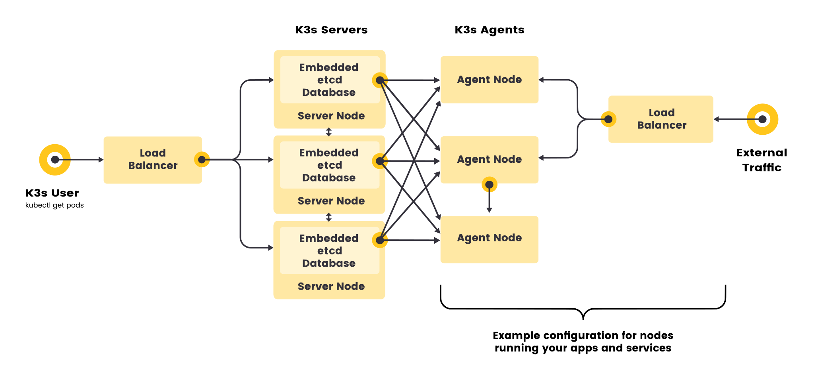

# Cluster K3S

## Labs Setup
### List Server
```
loadbalancer: 10.10.10.59/24
cp1: 10.10.10.160/24
cp2: 10.10.10.182/24
cp3: 10.10.10.54/24
worker1: 10.10.10.69/24
worker2: 10.10.10.165/24
worker3: 10.10.10.62/24
```

### K3S Component
```
- kubernetes
- containerd
- calico
- coredns
- etcd
- runc
- metric-server
- traefik
- helm-controller
- local-path-provisioner
```

### Topology


## Pre Install
### Add New User
```
useradd -m -s /bin/bash rafiryd
passwd rafiryd

echo "rafiryd ALL=(ALL:ALL) NOPASSWD:ALL" > /etc/sudoers.d/rafiryd
```

### Set hostname
```
// on node loadbalancer
hostnamectl set-hostname loadbalancer

// on node cp1
hostnamectl set-hostname cp1

// on node cp2
hostnamectl set-hostname cp2

// on node cp3
hostnamectl set-hostname cp3

// on node worker1
hostnamectl set-hostname worker1

// on node worker2
hostnamectl set-hostname worker2

// on node worker3
hostnamectl set-hostname worker3
```

### Set Timedate
```
timedatectl set-timezone Asia/Jakarta
```

### Set IP Static
```
vim /etc/netplan/00-installer-config.yaml
```

edit
```
# This is the network config written by 'subiquity'
network:
  ethernets:
    ens160:
      dhcp4: false
      addresses: [10.10.10.x/24]
      routes:
        - to: default
          via: 10.10.10.254
      nameservers:
        addresses: [1.1.1.1,8.8.8.8]
  version: 2
```

### Update & Upgrade
```
apt update -y && apt upgrade -y
```

## Setup Load Balancer
### Install HAProxy
```
apt install haproxy -y
```

### Configure HAProxy
```
vim /etc/haproxy/haproxy.cfg 
```

edit 
```
frontend kubernetes-frontend
    bind *:6443
    mode tcp
    option tcplog
    timeout client 10s
    default_backend kubernetes-backend

backend kubernetes-backend
    timeout connect 10s
    timeout server 10s
    mode tcp
    option tcp-check
    balance roundrobin
    server cp1 10.10.10.160:6443 check fall 3 rise 2
    server cp2 10.10.10.182:6443 check fall 3 rise 2
    server cp3 10.10.10.54:6443 check fall 3 rise 2
```

verify
```
haproxy -c -f /etc/haproxy/haproxy.cfg
```

restart
```
systemctl restart haproxy
```

check listen port
```
ss -tulpn | grep 6443
```

## Set up Cluster
### Setup control plane
Setup Cluster K3S Without Flannel we use Calico as CNI
```
curl -sfL https://get.k3s.io |  INSTALL_K3S_VERSION=v1.27.3+k3s1 sh -s - server --cluster-init --tls-san 10.10.10.59 --flannel-backend=none --disable-network-policy
```

get token
```
cat /var/lib/rancher/k3s/server/token
```

example token
```
qwertyuiop
```

### Setup other control plane
```
curl -sfL https://get.k3s.io | INSTALL_K3S_VERSION=v1.27.3+k3s1 sh -s - server --server https://10.10.10.59:6443 --token "qwertyuiop" --tls-san 10.10.10.59 --flannel-backend=none --disable-network-policy
```

### Setup worker node
```
curl -sfL https://get.k3s.io | INSTALL_K3S_VERSION=v1.27.3+k3s1 sh -s - agent --server https://10.10.10.59:6443 --token "qwertyuiop"
```

## Install Addon on cluster
### Worker Label
Add worker label
```
kubectl label node worker1 node-role.kubernetes.io/worker=worker
kubectl label node worker2 node-role.kubernetes.io/worker=worker
kubectl label node worker3 node-role.kubernetes.io/worker=worker
```                 
### Calico
Calico Operator
```
kubectl create -f https://raw.githubusercontent.com/projectcalico/calico/v3.26.1/manifests/tigera-operator.yaml
kubectl create -f https://raw.githubusercontent.com/projectcalico/calico/v3.26.1/manifests/custom-resources.yaml
```
### Dashboard
Deploy Dashboard
```
kubectl apply -f https://raw.githubusercontent.com/kubernetes/dashboard/v2.7.0/aio/deploy/recommended.yaml
``` 

Expose Dashboard
```
kubectl get all -n kubernetes-dashboard
kubectl edit svc kubernetes-dashboard -n kubernetes-dashboard
```

Access Dashboard
```
https://10.10.10.28:32224
```

Create Dashboard Admin User
```
vim dashboard.admin-user.yml
```

Edit
```
apiVersion: v1
kind: ServiceAccount
metadata:
  name: admin-user
  namespace: kubernetes-dashboard
```

Create Dashboard Admin Role
```
dashboard.admin-user-role.yml
```

Edit
```
apiVersion: rbac.authorization.k8s.io/v1
kind: ClusterRoleBinding
metadata:
  name: admin-user
roleRef:
  apiGroup: rbac.authorization.k8s.io
  kind: ClusterRole
  name: cluster-admin
subjects:
- kind: ServiceAccount
  name: admin-user
  namespace: kubernetes-dashboard
```

Deploy
```
kubectl apply -f .
```

Generate Token
```
kubectl -n kubernetes-dashboard create token admin-user
```
## Opsional 
### Reset Cluster
on server
```
/usr/local/bin/k3s-uninstall.sh
```
on agent
```
/usr/local/bin/k3s-agent-uninstall.sh
```

### Change Cluster Name
config file k3s 
```
vim k3s.yml
```

edit
```
apiVersion: v1
clusters:
- cluster:
    certificate-authority-data: DATA+OMITTED
    server: https://10.10.10.59:6443
  name: cluster2
contexts:
- context:
    cluster: cluster2
    user: admin-cluster2
  name: admin
current-context: admin
kind: Config
preferences: {}
users:
- name: admin-cluster2
  user:
    client-certificate-data: DATA+OMITTED
    client-key-data: DATA+OMITTED
```

check cluster config
```
kubectl config view
kubectl config get-contexts
```

### Access Multi Cluster
create new kubeconfig file
```
vim cluster-config
```

edit
```
apiVersion: v1
kind: Config
preferences: {}

clusters:
- cluster:
  name: cluster1
- cluster:
  name: cluster2

users:
- name: admin-cluster1
- name: admin-cluster2

contexts:
- context:
  name: cluster1-management
- context:
  name: cluster2-management
```

set cluster
```
kubectl config --kubeconfig=cluster-config set-cluster cluster1 --server https://ip-cluster1:6443 --certificate-authority-data=zzzz
kubectl config --kubeconfig=cluster-config set-cluster cluster2 --server https://ip-cluster2:6443 --certificate-authority-data=zzzz
```

set credentials
```
kubectl config --kubeconfig=cluster-config set-credentials admin-cluster1 --client-certificate-data=zzzzz --client-key-data=zzzzz
kubectl config --kubeconfig=cluster-config set-credentials admin-cluster2 --client-certificate-data=zzzzz --client-key-data=zzzzz
```

set contexts
```
kubectl config --kubeconfig=cluster-config set-contexts cluster1-management
kubectl config --kubeconfig=cluster-config set-contexts cluster2-management
```

verify
```
kubectl config --kubeconfig=cluster-config view
kubectl config --kubeconfig=cluster-config get-contexts
```

use context
```
kubectl config --kubeconfig=cluster-config use-context cluster1-management
kubectl config --kubeconfig=cluster-config use-context cluster2-management
```
### Connect Private Registry
login private registry
```
docker login https://url-registry
```

view registry credentials config
```
cat $HOME/.docker/config.json
```

create secret from registry credentials config
```
kubectl  create secret generic private-connect --from-file=.dockerconfigjson=$HOME/.docker/config.json --type=kubernetes.io/dockerconfigjson
```

create deployment with registry credentials config
```
vim deployment.yml

apiVersion: apps/v1
kind: Deployment
metadata:
  name: sample-apps-nginx
spec:
  selector:
    matchLabels:
      app: nginx
  template:
    metadata:
      labels:
        app: nginx
    spec:
      containers:
      - name: ct-nginx
        image: url-registry/local/nginx
        ports:
        - containerPort: 80
      imagePullSecrets:
        - name: private-connect
```